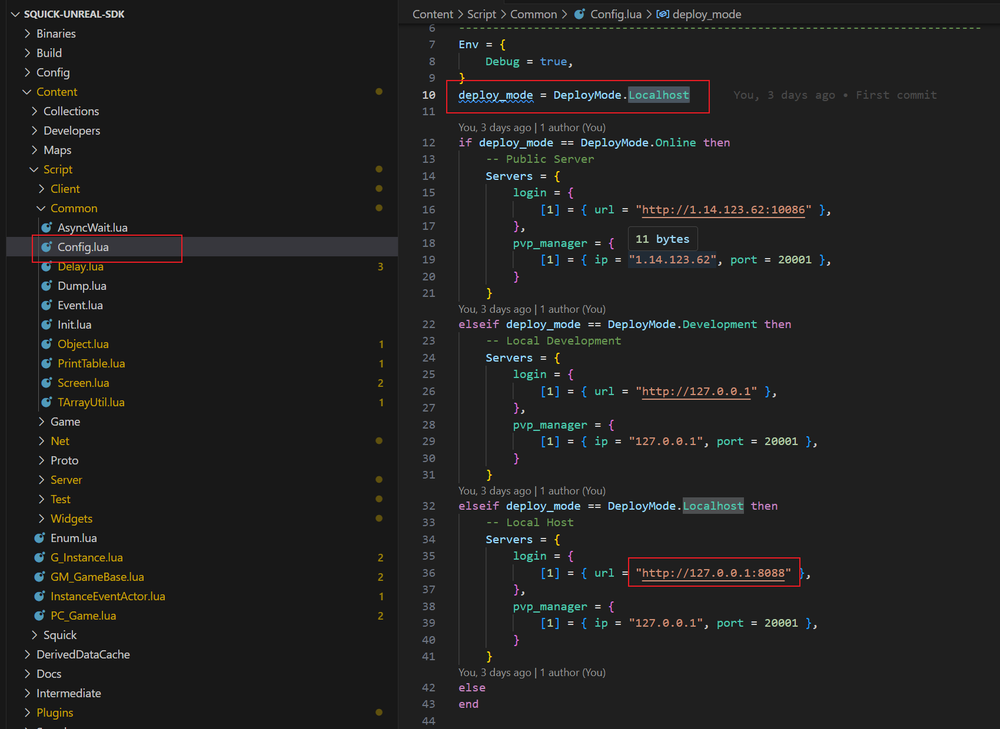

# Squick Unreal SDK

## Intro

Unreal Engine 5.3

The Quick Framework Unreal Development Package includes client and dedicated server demo code, based on the **Tencent Unlua **plugin. The logic is entirely written using **blueprints** and **Lua**.

Login protocol: http+json

Long connection protocol: tcp+protobuf

### The featrues

Support UE clients and dedicated servers.

Keep it simple, Just a network library.

##### Client

Mobile: Android、IOS

PC: Windows、Linux

##### Server

WindowsGUI(Dev)、LinuxGUI(Dev)、Linux(Deploy)

## Quick Start

### Step 1. Open project

Using Unreal Engine 5.3 to open **Action.uproject**

### Step 2. Modify login URL

Using VScode to open this project & modify

The default login url is http://127.0.0.1:8088, you can check your squick's login node ip & http_port

### Step 3. Run this project

Open Level: Content/Maps/Login

Just click the login

### Step 4. Login Succ

Client information.

Some logined player's info printed in screen and output log.

The server log:

## Start up Scenes

Client： Maps/Login

DS Server：Maps/Server

DS Server DEV：Maps/DS_DEV

## DS pack steps

#### Packaging with rendering DS server

Set the **PlatformGroup** variable in **Squick/Blueprints/SquickInstance** to **Server** and the **ServerPlatform **to either **Windows GUI or Linux GUI**

BuildTarget to select **Action**

Set the startup scene of Game to Maps/Server

Package as Windows or Linux

#### Packaging with no rendering DS server 

Set the **PlatformGroup** variable in **Squick/Blueprints/SquickInstance** to **Server** and the **ServerPlatform **to either **Windows or Linux**

BuildTarget to select **ActionServer**

Set the startup scene of the server to Maps/Server

Using the source code version UE for packaging as Windows or Linux

## Ref Plugins

### Unlua

Version：v2.3.6

[Download](https://img.shields.io/github/v/release/Tencent/UnLua)

#### Intro

This project integrates the Unlua series plugins, making it convenient for developers to use Lua scripts to customize the Protobuf+Socket package interaction protocol.

Lua calls each other with Blueprint and C++, please refer to：https://github.com/Tencent/UnLua

Unlua also integrates commonly used basic network libraries, namely LuaProtobuf, LuaRapidjson, and LuaSocket, under Plugins/UnLuaextensions/. However, no relevant learning examples are provided. I have partially organized them as follows:

**LuaProtobuf ** How to use serialization and deserialization, please refer to： https://github.com/starwing/lua-protobuf

**LuaSocket** How to use, please refer to：https://github.com/lunarmodules/luasocket

**LuaRapidjson** How to use, please refer to：https://github.com/xpol/lua-rapidjson
